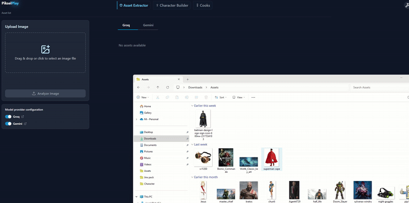
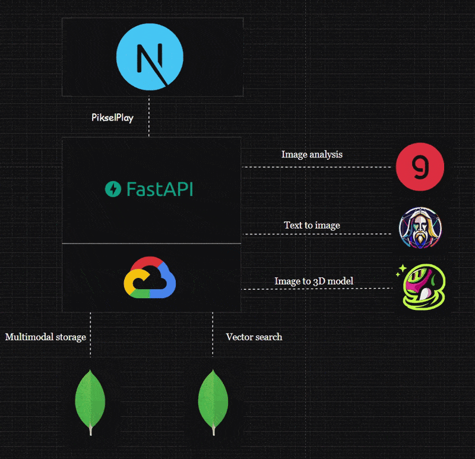

# PikselPlay
<div align="center">
  <h3>AI-Powered Asset Management Application for Image Art & 3D Assets</h3>
</div>

[Demo](https://pikselplay.netlify.app)
---

## ✨ Key Features

- 🔍 **Image Analysis** - Breakdown using multimodal LLM. Parse any asset from your gallery or photography
- 🔎 **Vector Search** - Optimized queries for large scale data management
- 🎯 **2D to 3D Conversion** - Generate 3D models from images using Meshy, ready for Unity or Unreal projects
- ⚙️ **Automated Workflows** - *Coming soon*

---

## 🛠 Tech Stack

| Component | Technology |
|-----------|------------|
| **Frontend** | Next.js, TypeScript, Tailwind CSS |
| **Backend** | FastAPI (Agentic workflow, Image processing), MongoDB |
| **LLMs** | Gemini, LLaMA for image processing, Flux Dev for generation, Meshy for 3D |
| **Infrastructure** | Google Cloud Platform |

---

## 📋 Core Modules

### 🎨 A. Asset Generator



The Asset Management System serves as a comprehensive toolkit for creating, organizing, and utilizing visual assets for characters in creative and entertainment environments.

#### 📂 Asset Extraction & Organization

**Categorization System** - Organize assets into four main categories:

- 👤 **Body Elements** - Hairstyles, facial features, body modifications
- ⚔️ **Equipment** - Weapons, armor, tools, wearable technology  
- 👕 **Clothing** - Upper/lower wear, footwear, headwear, accessories
- 🌍 **Background Elements** - Settings, visual effects, environmental objects

**Key Capabilities:**
- 🔍 Search and filter assets through intuitive interface
- 🤖 AI-powered metadata extraction and automatic categorization
- 👀 Preview and modify assets before implementation

#### 💡 Value Proposition

- ⚡ **Accelerate Workflows** - Intelligent organization and quick-access filtering
- 🎯 **Creative Consistency** - Centralized repository of pre-approved visual elements
- ♻️ **Reduce Redundancy** - Discoverable and reusable assets with vector comparison
- 🔗 **Bridge Roles** - Visual interface requiring no programming knowledge
- 📈 **Scale Production** - Efficient management of large asset libraries

#### 🚀 Innovations & Technology

- 🧠 **AI-Powered Categorization** - Automatic visual asset analysis and tagging
- ⚡ **Reactive UI** - Real-time feedback for asset selection and combination
- 🔎 **Advanced Search** - Visual similarity and contextual relevance beyond text matching
- 📊 **Category Visualization** - Clear asset relationship understanding

#### 🤖 LLM Models

| Provider | Model | Access |
|----------|-------|--------|
| **Groq** | `meta-llama/llama-4-scout-17b-16e-instruct` | Free for demo users |
| **Google** | `gemini-1.5-flash` | Requires Gemini API Key |

#### 🗄️ MongoDB Integration

- 🔍 **Atlas Vector Search** - Find similar assets and creation opportunities
- 📦 **Multimodal Storage** - Images, text, and vectors in unified collections

---

### 🏗️ B. Model Builder


Interactive, asset-driven interface for character creation with real-time feedback and seamless 2D/3D integration.

#### ✨ Core Features

- 🎯 **Asset Selection & Organization**  
  Drag-and-drop or click to add assets from categorized groups with real-time management

- 🎨 **AI Sketch Generation**  
  Instant character sketches with progress feedback and error handling

- 📦 **Bulk Actions**  
  Multi-select for batch operations (download, clear selection)

- 🎭 **3D Model Preview**  
  Generate and toggle between 2D sketches and 3D models (GLB format)

- 📊 **Asset Usage Transparency**  
  Detailed overlays showing asset contributions to generated sketches

- 📱 **Responsive Design**  
  Smooth transitions and adaptive layouts for all screen sizes

#### 💎 Value Proposition

- ⚡ **Accelerated Workflows** - Seamless asset selection and sketch generation
- 🔄 **2D/3D Bridge** - Unified creation experience
- 👥 **User-Friendly** - Intuitive, visually-driven interface
- 📈 **Scalable** - Fast search, filtering, and bulk actions for large libraries

---

## 🏗️ Code Structure

```bash
char-ui/
├── public/          # Static assets
├── src/             
│   ├── components/  # UI components & animations
│   ├── lib/         # Utilities & helpers
│   ├── hooks/       # Custom React hooks
│   ├── stores/      # Zustand state management
│   ├── features/    # Pages: Landing, Asset Analysis, Character Builder
│   ├── functions/   # API calls & services
│   ├── constants/   # Configuration & enums
│   └── types/       # TypeScript definitions
```

---

## 🚀 Getting Started

### Frontend Setup

```bash
git clone https://github.com/xkazm04/char-ui.git
cd char-ui
npm install
npm run dev
```

### Backend Setup

```bash
git clone https://gitlab.com/xkazm04/char-service
cd char-service
pip install -r requirements.txt 
uvicorn main:app --reload
```

### Database Setup

Choose your MongoDB option:

- 📦 **Local**: [MongoDB Installation Guide](https://www.mongodb.com/docs/manual/installation/)
- ☁️ **Cloud**: [MongoDB Atlas](https://www.mongodb.com/docs/atlas/)

---

## 🏛️ Architecture



---

## 🔐 Environment Variables

*Configuration details coming soon*

---

<div align="center">


**Built with ❤️ for creators and developers**

</div>